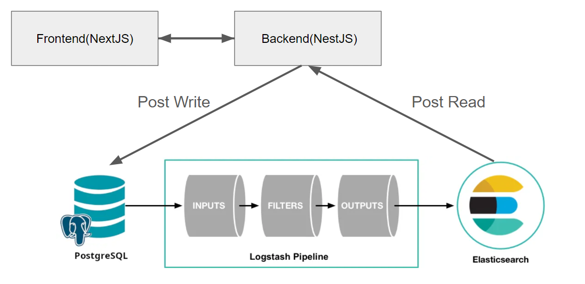

# CafeCollaborations

## 사장이랑 블로거랑 (블로그 형식)

이 프로젝트는 **NestJS**를 사용한 백엔드와 **Next.js**를 사용한 프론트엔드로 구성된 풀스택 블로그 애플리케이션입니다. Docker를 사용하여 인프라를 관리하며, 손쉬운 설정 및 배포가 가능합니다.

## 프로젝트 구조

```bash
├── frontend
├── backend
└── infra (docker)
```

### backend

백엔드는 **NestJS**로 구축되었으며, 이는 확장 가능하고 유지보수하기 쉬운 서버 사이드 애플리케이션을 만들 수 있는 진보적인 Node.js 프레임워크입니다.

- **기술 스택**: NestJS, TypeScript, PostgreSQL, JWT
- **주요 기능**:
  - 사용자 인증 및 권한 부여
  - 블로그 게시물에 대한 CRUD 기능
  - 댓글 시스템
  - RESTful API 설계


### frontend

프론트엔드는 **Next.js**로 개발되었으며, 이는 React 기반 웹 애플리케이션에 서버 사이드 렌더링과 정적 웹사이트 생성을 가능하게 하는 프레임워크입니다.

- **기술 스택**: Next.js, React, TypeScript, React Query,
- **주요 기능**:
  - 반응형 디자인
  - 동적 라우팅
  - Context API를 활용한 상태 관리
  - SEO 최적화

### infra

Docker를 사용하여 인프라를 관리하며, 애플리케이션을 다양한 환경에서 쉽게 컨테이너화하고 배포할 수 있습니다.

- **Docker**:
  - 백엔드와 프론트엔드를 모두 컨테이너화
  - 개발 및 운영 환경 간의 일관성 보장
  - `docker-compose`를 통해 배포 프로세스 간소화

인프라 구조
<p align="center"> 
    
</p>


## 시작하기

### 필수 조건

- **Node.js** (버전 18.x 이상)
- **Docker** (버전 23.x 이상)
- **npm** (버전 9.x 이상)
- **pnpm** (버전 9.x 이상)

### 설치 방법

1. **레포지토리 클론**:

   ```bash
   git clone https://github.com/your-username/your-blog-project.git
   cd your-blog-project
   ```

2. **백엔드 디렉토리로 이동 후 의존성 설치**:

   ```bash
   cd backend
   pnpm install
   ```

3. **프론트엔드 디렉토리로 이동 후 의존성 설치**:

   ```bash
   cd ../frontend
   npm install
   ```

4. **Docker를 사용하여 개발 환경 시작**:
   ```bash
   cd ../infra
   docker-compose up
   ```

### 프로젝트 실행

- 프론트엔드는 `http://localhost:3000`에서 접근 가능합니다.
- 백엔드 API는 `http://localhost:3001/api`에서 접근 가능합니다.

### 환경 변수 설정

각각의 `backend`와 `frontend` 디렉토리에 필요한 환경 변수를 포함한 `.env` 파일이 있는지 확인하세요.

필요한 변수에 대한 자세한 내용은 각 디렉토리의 `.env.example` 파일을 참조하세요.
