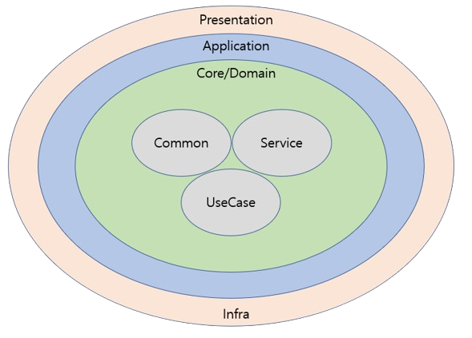

# NestJS Clean Architecture ([from](https://github.com/pvarentsov/typescript-clean-architecture))

<p align="center"> 
    
</p>

## Presentation

표현 계층으로 외부의 Client와 직접 접촉하는 곳이다.컨트롤러 및 swagger 설정을 갖는다

```bash
presentation
├── rest-doc
└── **.controller
```

## Application

서버 애플리케이션의 기본 설정 예외 필터,인터셉터,인증/인가 를갖는다.

- 서버 애플리케이션 설정 및 초기화 소스를 갖는다. (ServerApplication)

  - Exception Filter
    - NestHttpExceptionFilter
  - Interceptor
    - NestHttpLoggingInterceptor
      로깅 전용 인터셉터로, ApiServerConfig의 `LOG_ENABLE`이 true 일 경우 infrastructureModule의 providers에 포함된다.
  - Auth
    - Passport & JWT 기반 인증 및 인가 서비스 (HttpAuthService)
    - Decorator
    - Gaurd
    - Passport
    - Type

## IOC (IOC 컨테이너)

- 각 서비스 Module에 DI 하는 로직을 갖는다.
  - .RootModule  
    모든 모듈을 일괄 imports하는 최상위 모듈이다. ApplicationServer와 TestServer에서 서버 객체를 생성하는 곳에서 인자로 활용된다.
  - InfrastructureModule - imports - CqrsModule - PrismaModule
    f - providers - NestHttpExceptionFilter - NestHttpLoggingInterceptor - NestCommandBusAdapter - NestQueryBusAdapter - NestEventBusAdapter - exports - CoreDITokens.CommandBus (Symbol) - CoreDITokens.QueryBus (Symbol) - CoreDITokens.EventBus (Symbol)
  - 각종 서비스 모듈 (AuthModule, UserModule, PostModule, MediaModule 등)

## Infrastructure

- Adapter implementation
  - Bus adapter(CQE) - NestJS
  - Persistence
    - Prisma
      - Entity
        - Entity
        - Mapper
      - Repository
        Service에서 Repository port input을 통해 호출하는 Repository Adaper 이며, DB CRUD 구현체를 갖는다.
  - UseCase input adapter  
    Controller에서 UseCase를 execute 하기 전에 execute 메서드 인자에 포함되는 adapter로, UseCase에서 실행하기 전에 adapter 데이터를 생성하는데, new 메서드를 통해 생성할 때(new 키워드가 아닌 직접 구현한 new 메서드) 데이터 유효성 검사(validate)를 한 데이터 객체이다.
- Config - 서버 및 외부 DB의 설정 파일
  - ApiServerConfig
    서버의 호스트, 포트, 액세스 토큰, 액세스 토큰 TTL, 로깅 활성여부 등
  - DatabaseConfig
- Handler wrapper - NestJS  
  @nestjs/cqrs의 `IQueryHandler`, `IEventHandler` 등의 인터페이스를 구현한다.
  이 CQRS는 반드시 Bounded Context에서만 사용해야 하고, 시스템 전체에서 사용해서는 안된다.
  CQRS는 요구사항이 많아 복잡해진 도메인 모델을 한결 쉽게 다루기 위해 Command(CUD)와 Query(Read)로 분리해 개별적으로 확장 및 최적화 전략 적용을 가능하게 해준다.
- Transaction wrapper - prisma & @nestjs-cls/transactional 적용

## Domain / Core Context

비즈니스 로직 구현부는 아니고 도메인 객체 및 인터페이스를 제공한다. 이 앱에선 보일러플레이트로 User, Post, Media 컨텍스트를 갖는다.

- Entity class, ValueObject class
- Port interface
  Repository, FileStorage, UseCase의 input port 로 구성된다. 이 input port는 request DTO 형태의 인터페이스로 이해하면 된다.
  특정 UseCase가 TransactionalUseCase, UseCase를 상속받을 때 DTO와 함께 인자 타입으로 부여된다.
  이 UseCase를 Service에서 상속받아 처리한다.
- UseCase interface
  각 도메인 행위에 대한 UseCase, UseCase를 호출시 인자에 넣을 UseCasePort와 UseCaseDto를 갖는다.
  UseCasePort는
  비즈니스 로직을 수행하기 위해 서비스에서 UseCase의 `execute` 메서드를 implements 한다. 따라서 각 서비스는 1:1 대응되는 UseCase를 가지며, 호출시 `execute` 메서드만 호출하면 된다.
- Command / Query / Event handler interface
- DI Tokens
  DI Tokens에는 UseCase, Handler, Repository의 이름을 심볼로 가지며,
  Controller에서는 UseCase를 Inject 받을 때,
  Application/di의 특정 모듈에서는 UseCase, Handler, Repository를 provide, inject 할 때,
  각종 e2e, unit 테스팅 시 Repository를 가져오거나 모듈에서 토큰으로 provide, inject 할 때 심볼로 활용된다.

## Core services

UseCase 구현체와 Command / Query / Event handler의 구현체를 갖는다.

이 앱에선 보일러플레이트로 User, Post, Media 서비스를 갖는다.

기존의 계층형 아키텍처 기반 개발 환경에서는 팀이 아키텍처에 강제성을 부여하지 않는 이상 하나의 도메인 서비스는 비대해지기 쉽다. 너비가 넓어진 서비스는 영속성 계층에 많은 의존성을 갖게 되고, 표현 계층(웹 레이어)의 많은 컴포넌트가 이 서비스에 의존하게 된다.

서비스의 복잡성을 낮추기 위해 하나의 도메인 서비스는 하나의 유스케이스만 담당하도록 하면 수정이 필요한 비즈니스 영역을 찾기도 쉽고 테스트하기에도 좋게 된다. 예를 들어 PostService에서 게시물 생성 유스케이스를 찾아 수정하는 것이 아니라 게시물 생성만을 위한 CreatePostService를 찾아 유스케이스를 수정하는 것이 있다.

하나의 유스케이스로 특화된 도메인 서비스의 또 다른 장점으로는 동시 개발의 편의성이 있다. 기존의 계층형 아키텍처의 경우 여러 명이 하나의 서비스에 여러 개의 유스케이스를 추가해야 할 때, merge conflict가 발생하기 쉽고, 잘못된 코드를 이전의 상태로 되돌려야 할 때에도 문제가 발생할 수 있다. 반면 하나의 도메인 서비스가 하나의 유스케이스를 담당하도록 하면 기존의 문제는 사라지거나 경감될 것이다.

- Service
  - Handler  
    각종 CQE 핸들러를 implements 받아 handle 메서드를 구현하는 서비스 클래스이다.
    컨트롤러에서 CQE send 요청을 보내면 이를 처리하는 공간이다.
    CQE 전달 및 수신 순서는 다음과 같다.
    NestWrapper{비즈니스*로직*이름}{C/Q/E}Handler.handle(…) →
    Handle{비즈니스*로직*이름}{C/Q/E}Service.handle(…)
  - Usecase  
    CreateUserService, GetUserService, CreatePostService 등 각 서비스는 하나의 행위만 담당한다. 따라서 하나의 컴포넌트를 변경해야 할 때 변경하는 이유가 오직 하나로 좁혀지므로 단일 책임 원칙을 지키는 형태가 된다.
    UseCase 또는 TransactionalUseCase를 implements 하므로 execute 메서드를 반드시 구현한다.
    execute 메서드에 인자로 request DTO인 Port를 제공하고, 반환은 UseCaseDTO로 받는다. 만약 RemovePostService와 같이 execute 시 돌려받을 데이터가 없는 경우 void로 명시한다.

## Domain / Core Common

- Common types
  - `type Nullable<T> = T | null`
  - `type Optional<T> = T | undefined`
- Code
  `code: number` 와 `message: string`의 타입을 갖는 메세지 클래스. 테스트 작성시 응답 메시지로 사용되며, CoreApiResponse에서 success, error 메서드의 응답 객체로 사용된다.
- Entity enums
- Entity (Base Entity class)
  - Entity
  - RemovableEntity
- Base ValueObject class
- Exception (Base Exception class = 예외 처리 )
  Guard, Strategy, Base Entity, Base VO, 서비스 등에서 `new` 정적 메서드를 통해 예외를 생성하는데 사용된다.
- Base UseCase interface
  - TransactionalUseCase
    트랜잭션을 동반하는 유즈케이스
  - UseCase
    일반적으로 사용하는 유즈케이스
- Base UseCase adapter class
  - UseCaseValidatableAdapter
    특정 UseCase가 validate 될 수 있는지 확인하는데 사용된다.
    내부적으로 Util의 `ClassValidator.validate()` 메서드를 호출한다.
- Util
  - CoreAssert
    서비스 로직에서 값이 true 또는 false, 혹은 empty가 아니라고 단언해 코드 직관성을 높이는데 활용한다. - `isTrue(expression: boolean, exception: Error): void` - `isFalse(expression: boolean, exception: Error): void` - `notEmpty<T>(value: Optional<Nullable<T>>, exception: Error): T`
  - ClassValidator
    Entity와 ValueObject, UseCaseValidatableAdapter 또는 테스트 코드에서의 MockClass 등의 객체가 유효한지 판단한다.
    e.g. Entity 또는 VO를 올바르지 않은 타입의 인자을 통해 생성한 경우 유효하지 않다.
    만약 유효하지 않은 경우 `ClassValidationDetails`를 반환한다.
- Api
  - CoreApiResponse
    Controller에서 모든 API의 Base 응답 객체로 사용된다.
    code, message, timestamp, data 읽기 전용 필드와 success, error 정적 메서드를 갖는다.
    NestHttpExceptionFilter와 NestHttpLoggingInterceptor 에서도 응답 또는 로깅하는데 사용된다.
- DI (Base DI tokens)
  - CoreDITokens
    CQERS의 핵심인 CommandBus, QueryBus, EventBus를 심볼로 갖는다.
- Port / message
  - CommandBus / QueryBus / EventBus port interface
    Nest{Command / Query / Event}BusAdapter 에서 implements 하며, 이 어뎁터는 infrastructureModule에서 provider token 이름으로 `CoreDITokens.토큰명`으로 선언했고, `CoreDITokens.토큰명`을 exports 해 모든 모듈의 custom provider에서 inject 할 수 있도록 한다. 이 `CoreDITokens.토큰명`을 inject 받는 UseCase는 CQE를 호출할 수 있게 된다.
- Message
  - command
    - CommandHandler
      core/domain/서비스/handler/ 의 각 커맨드 핸들러에서 extends 받을 Base 커맨드 핸들러
    - commands
  - query
    - QueryHandler
      core/domain/서비스/각 쿼리 핸들러에서 Base 쿼리 핸들러
    - queries
      - 서비스/usecase/의 서비스 및 서비스/handler/의 핸들러에서 query시 사용할 쿼리 클래스
      - query result 클래스
        QueryBus의 queryBus.execute(query)의 반환 객체를 담는 역할을 한다.
  - event
    - EventHandler
      core/domain/서비스/각 이벤트 핸들러에서 사용될 Base 이벤트 핸들러

#### Main Entities

1. User
2. Post

#### Use Cases

- User -> Post

  1. `User` 는 비로그인 유저는 `Post` 읽을수 있다
  2. `User` 는 `Post` 를 생성할수있다

- User -> Post

  1. `Author` 는 자신의 포스터에 `Post` 수정/생성/발행 할 수 있다

## Local Development

- **Building**

  1. Install libraries - `pnpm install`
  2. Build application - `npm run build`

- **Configuring**

  Configuring is based on the environment variables. All environment variables must be exposed before starting the application.
  See [all environment variables](./env/local.app.env).

- **Running**

  - Start application - `npm run start`
  - Expose [./env/local.app.env](./env/local.app.env) and start application - `npm run start:local`

    <details>
      <summary>
        API documentation will be available on the endpoint <i>GET <a href="http://localhost:3005/documentation/" target="_blank" rel="noopener noreferrer">http://localhost:3005/documentation</a></i>
      </summary>
      <br>
      
      <p align="center"> 
          
      </p>
    </details>

- **Linting**

  - `npm run lint`
